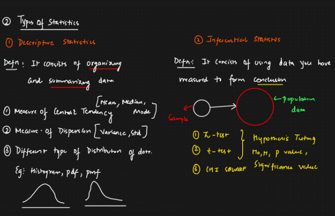
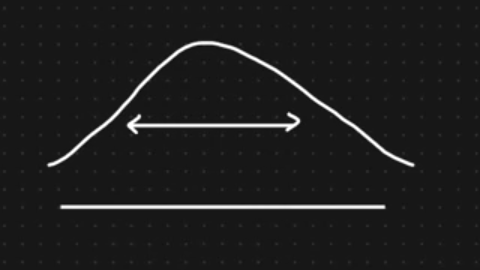
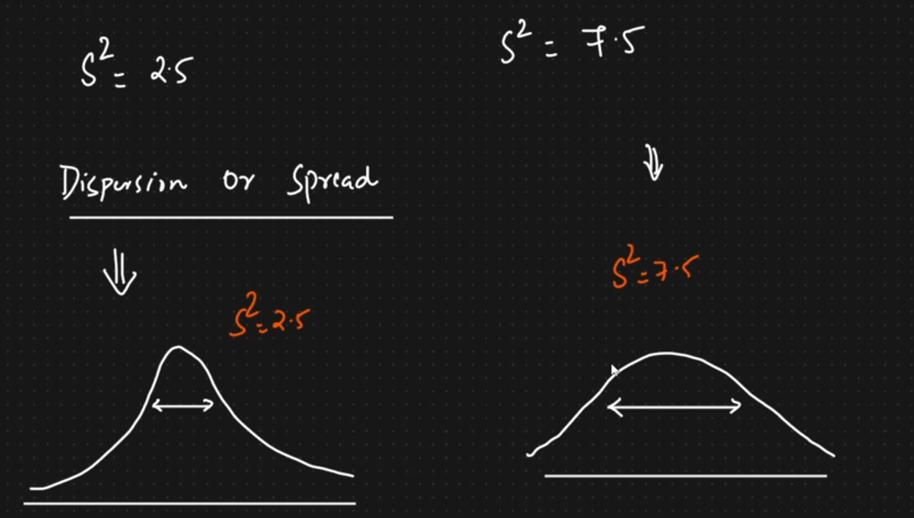
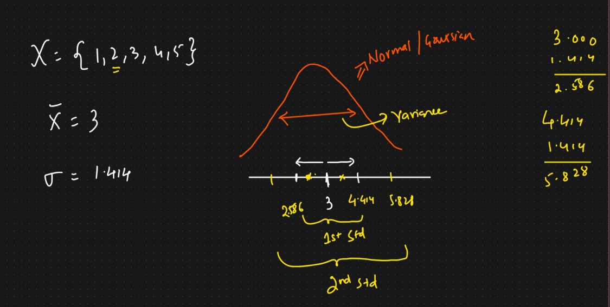
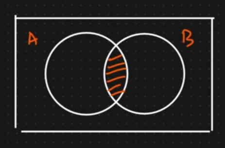
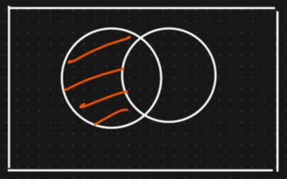

# Statistics Basic

## Contents

1. Introduction to Statistics
2. Types of Statistics

---

## Introduction to Statistics

Statistics is the science of collecting, organizing and analyzing data.

**Data**: Facts or paces of information

### Examples

- Height of student (75cm, 180cm)
- IQ of a group of people (120, 130)

## Types of Statistics

| Topics | Descriptive Statistics                          | Inferential Statistics                                           |
| ------ | ----------------------------------------------- | ---------------------------------------------------------------- |
| Def.:  | It consists of organizing and summarizing data. | It consists of using data you have measured to form conclusions. |



[Drive Link](https://drive.google.com/file/d/1v0fkGmGcwldqxsTpGqDcjL1HDuQYub1k/view)

## Levels of Measurement (⭐⭐⭐⭐⭐)

### Scale of Measurement

1. Nominal Scale Data
2. Ordinal Scale Data
3. Interval Scale Data
4. Ratio Scale Data

#### Nominal Scale Data

1. It is `Qualitative/Categorical` data.
   e.g. Gender, Colors, Labels
2. Order does not matter

`i.e.` **Favorite Color**

```sh
            (Conclusions)
Red     -> 5 ---> 50%
Blue    -> 3 ---> 30%
Orange  -> 2 ---> 20%
--------------
          10
```

> (Order does not matter) -> It means here `Red`, `Blue`, `Orange` none of theme are superior to others, any order of theme does not matter only the data associated with labels matter
> Basically, Here `Red` is not greater then `Blue`, or `Orange` is not greater then `Red` so on.
> other e.g. `Gender (M, F)`

#### Ordinal Scale Data

1. Ranking is important
2. Order matters
3. Difference cannot be measured

`i.e.` **Any app showing the reviews in 3 format**

```sh
1. Best
2. Good
3. Bad
```

> Here, Rand and Order matter the most

##### **Difference cannot be measured**

```sh
Race:
    1st
    2nd
    3rd
```

- So, in this type of data we cannot really find the difference.
- Here, Order and Ranking the the most important information.

#### Interval Scale Data

1. The order matters
2. Difference can be measured
3. Ratio cannot be measured
4. No true "Zero(0)" starting point

`i.e.` **Temperature Variable**

```text
1. 30°F -----+
            | Order matters
2. 60°F -----+-----+
                  | (90°F - 60°F) = 30°F (Difference Can be
                  | measured)
3. 90°F -----------+-----+
                        | 60:30 = 2:1 (It doesn't mean that
                        | 2 is twice of 1, I could be any
                        | thing so the measurement of
                        | Ration doesn't really matter)
4. 120°F ----------------+-----+
                              | There is not true Zero
                              | Point Starting
5. -30°F ----------------------+
```

#### Ratio Scale Data

1. The Order matters
2. Difference are measurable `(Including Ratio)⭐⭐⭐`
3. Contain a "Zero (0)" starting point

`i.e.` **Students marks in a class**

```text
s1  s2  s3  s4  s4  s6  s7
--------------------------
90, 60, 30, 75, 40, 50, 0
```

**Ascending Order** = 30, 40, 50, 60, 75, 90

- (We can definitely calculate the differences)
  40 - 30 = 10;  
   50 - 30 = 20;
- Ratio = 90/30 = 3:1 (So we can say student s1 got 3x marks then student s3)
- As, Student s7 got 0, And marks can't be negative. So there is a `Zero (0)` Starting Point.

#### Task: (Find which class it belongs to?)

1. Length of Different Rivers in the World.?
2. Favorite food based on Gender?
3. Marital Status?
4. IQ Measurement?

## Measure of Dispersion

- Spread of the data
- [Examples](./2_measures_of_dispersion.ipynb)



1. Variance
2. Standard Deviation

### Variance

#### Population Variance

$$
   \displaystyle \sigma^2 = \sum_{i=1}^N \frac{(x_i - \mu)^2}{N}
$$

- $x_i \displaystyle \rightarrow$ Data Points
- $\mu \displaystyle \rightarrow$ Population Mean
- $N \displaystyle \rightarrow$ Population Size

#### Sample Variance

$$
   \displaystyle S^2 = \sum_{i=1}^n \frac{(x_i - \bar{x})^2}{n-1}
$$

- $x_i \displaystyle \rightarrow$ Data Points
- $\bar{x} \displaystyle \rightarrow$ Sample Mean
- $n \displaystyle \rightarrow$ Sample Size

#### Why we divide Sample Variance by n-1?

- The sample variance is divided by n-1, So that we create an **unbiased estimator** of the population variance.
- This is also called Bencie Correction
- **Estimator** We will learn later

`i.e.` **{1, 2, 3, 4, 5}**

$$
   \displaystyle S^2 = \sum_{i=1}^n \frac{(x_i - \bar{x})^2}{n-1}
$$

| x   | $\bar{x}$ (mean of x) | $(x_i - \bar{x})^2$ |
| --- | --------------------- | ------------------- |
| 1   | 3                     | 4                   |
| 2   | 3                     | 1                   |
| 3   | 3                     | 0                   |
| 4   | 3                     | 1                   |
| 5   | 3                     | 4                   |

$$
s^2 = \frac{10}{4} = 2.5
$$

#### Dispersion or Spread

- Basically Variance tell us about the spread
- Spread $\uparrow$, height $\downarrow$



### Standard Deviation

- Population Standard Deviation
- Sample Standard Deviation

| Population Standard Deviation | Sample Standard Deviation                   |
| ----------------------------- | ------------------------------------------- |
| $\sigma = \sqrt{Variant}$     | $std = \sqrt{S^2}$; $S^2 = Sample Variance$ |

---



## Random Variable

$x + 5 = 7$;

$8 = y + x$;

- Random variable is a process of mapping the output of a random process or experiment to a number

`i.e.` **Tossing a Coin**

$$
X =
   \begin{cases}
   0 & \text{if Head} \\
   1 & \text{if Tails}
   \end{cases}
$$

### other examples

- Rolling a dice
- Measure the temperature of the next day

$$
Y =
   \begin{cases}
      \text{Sum of the rolling of dice 7 times}
   \end{cases}
\\

\dArr

\\

P_r(y \ge 15) \space \space \space P(y < 10)
$$

## Sets

- Organized collection of elements

A = {1,2,3,4,5,6,7,8}
B = {3,4,5,6,7}

### Operations

#### Intersection

- Common Elements

$$
A \cap B = \{3, 4, 5, 6, 7\}
$$



#### Union

- Combining all the elements

$$
 A\cup B=\{1,2,3,4,5,6,7,8\}
$$

#### Difference

$$
A - B = \{1, 2, 8\}
$$



#### Subset

- $A \rightarrow B \rArr \text{False}$
- $B \rightarrow A \rArr \text{True}$

#### Superset

- $A \rightarrow B \rArr \text{True}$ (Basically it means is A the superset of B) | Is all the elements of B present in A?
- $B \rightarrow A \rArr \text{False}$

## Histograms And Skewness

- Frequency
